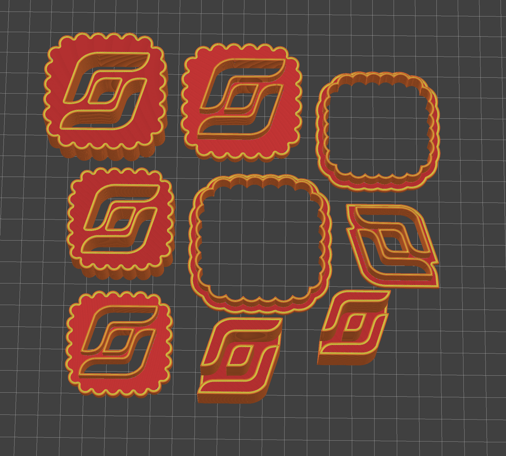

#  ITscope Cookie Cutter 🍪

Parametric Cookie-Cutter with the [ITscope](https://www.itscope.com) company Logo.
Start your printer and get ready for Christmas.🎄

## ⭐ Features
 ⭐ Customizable  
 ⭐ Easy FDM printing  
 ⭐ Settings for Icon and Logo  
 ⭐ Usage is as easy as pie

## 💿 Setup

Install [OpenScad](https://openscad.org) and open the [ITS-Cookie-Cutter.scad](ITS-Cookie-Cutter.scad) file.  
Optional: For coding like a pro you can use the IntelliJ [OpenSCAD Language Support](https://plugins.jetbrains.com/plugin/11198-openscad-language-support).

> 🖨️ Print ready `.stl`-files are provided in the `print` folder.

## 🔧 Print Settings

Check these settings to ensure a good print quality.
- Layers
    - Avoid Crossing Perimeter
    - Seam Position: Aligned
- Advanced
    - Elephant foot compensation: 0,2 mm
- Infill
    - Gyroid
    - 15%

## 🧑‍🍳 Cookie condiments

 * 100g (1/2 cup packed) soft light brown sugar
 * 340g (2 1/2 cups) sifted plain flour
 * 1/2 tsp baking powder
 * 1/2 tsp salt
 * 1/4 tsp ground cinnamon
 * 225g (1 cup) unsalted butter
 * 1 large free range egg
 * 1 tsp vanilla extract
 * 12 ounces raspberry jam, sieved
 * caster sugar for dusting (very fine granulated sugar)
 
## 🍪 Serving suggestion

_powered by_  
